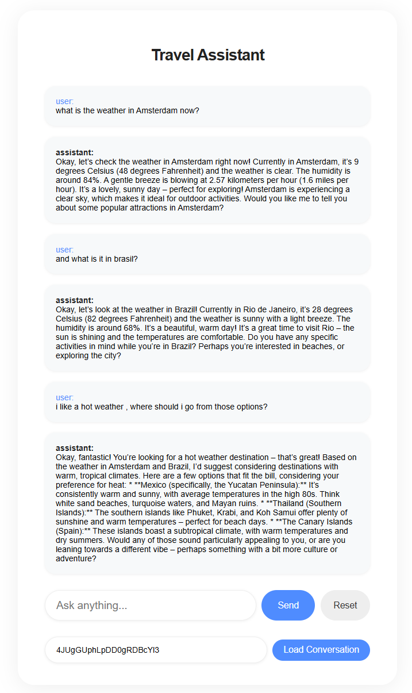

# Travel Assistant APP

## Requirements

- **Node.js** 18+ (for native ES modules and watch mode)
- **Ollama** instance running on your local.
- **Angular** so you can serve the UI locally
- **Optional**: OpenWeather API key for weather data (free tier available)

## Quick Start

### 1. Install Dependencies

```powershell
npm install
```

### 2. Set Up Ollama

1. Install Ollama from [ollama.ai](https://ollama.ai)
2. Pull a model:
```powershell
ollama pull llama3.2
```
3. Start Ollama (it usually runs automatically):
```powershell
ollama serve
```

### 3. Configure Environment

Copy `.env.example` to `.env`:

```powershell
Copy-Item .env.example .env
```

Edit `.env` with your settings.
see that the port matches to the one on the UI (src/UI/src/app/env/environments/environment.ts)
3000 is recommanded

### 4. Start the Server

```powershell
npm start
```

For development with auto-reload:
```powershell
npm run dev
```

### 4. Start the UI

navigate to the UI folder (src/UI) and do:
```powershell
ng serve
```
to run the UI

## Focuses

### 1. Handles multiple travel query types

The app supports destination recommendations, weather info, local attractions and more..

### 2. handle follow-up questions and maintain context
Conversation history is preserved and shown in the UI, allowing follow-up questions and context-aware responses.

### 3. Chain of thought
when the user asks for destination recommendations or complex travel advice, your prompt templates guide the LLM to:
Consider user preferences and constraints.
Think through possible options.
Explain the reasoning process before giving a final answer.

### 4. Modern stack
Uses Node.js, Angular, and Ollama.

## Example
### handle follow-up questions and maintain context
In this example you can see how the chatbot
perserve context and base his responses on previous messages:




##  Brief notes on key prompt engineering decisions
1. **Smart Base Prompt**
- Made the AI think step-by-step for better recommendations
- Keeps responses natural but structured (Markdown like syntax)
- Built-in error handling when AI isn't sure

2. **Context Management**
- AI remembers previous chat context
- Uses past messages to give better follow-ups
- Keeps conversation flowing naturally

3. **Real Data + AI Knowledge**
- Blends data with AI knowledge, but prioretize real-time data.
- Falls back gracefully when real-time data isn't available.
- Clear about what it knows vs what it's getting from external sources in real time.

4. **Error Handling**
- Asks for clarity when needed.
- Admits when it's not sure instead of making stuff up.